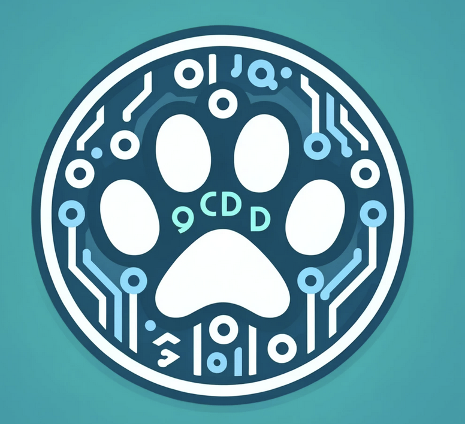

# Pet Store - Backend Final Project

| Course   | Course Name         | Professor    | Semester / Year |
| -------- | ------------------- | ------------ | --------------- |
| CPSC 449 | Backend Engineering | Jayraj Arora | Spring 2024     |

# Developers: Pet Query Group

| Name          | Email                            | Contribution                             |
| ------------- | -------------------------------- | ---------------------------------------- |
| Erwin Medina  | erwinmedina@csu.fullerton.edu    | Caching, DB, Presentation, Main CRUD     |
| Abel Mendoza  | abel_mendoza10@csu.fullerton.edu | ReadMe <unsure>                          |
| Akshat Javiya | akshatjaviya02@csu.fullerton.edu | Load Balancer, Presentation, Main CRUD   |



## Objective

The goal of this project is to develop a scalable and secure backend for a Pet Store application, leveraging advanced technologies to manage user authentication, session management, and high-load operations efficiently. The project builds upon previous work by enhancing security measures and implementing caching mechanisms to handle increased traffic and data interaction demands effectively.

## Features

- **User Authentication**: Securely manage user sessions and data access using Flask-JWT-Extended.
- **Password Encryption**: Utilize Flask-Bcrypt for hashing and verifying passwords to ensure data security.
- **Data Caching**: Implement Redis caching to reduce database load and improve response times for frequently accessed data.
- **Load Balancing**: Utilized Nginx to distribute HTTP requests as a load balancer, improving response times.
- **Error Handling**: Advanced error handling mechanisms for debugging and smoother user experience.
- **API Development**: RESTful API endpoints for managing pet store inventory and user interactions.

## Technologies Used

- **Python**: Primary programming language.
- **Flask**: Web framework for building the API.
- **MongoDB**: NoSQL database for storing user and product data.
- **Redis**: In-memory data structure store used as a cache and session store.
- **Nginx**: Utilized to handle incoming HTTP requests, and distribute them to appropriate servers, serving as a load balancer.

This project is focused on the backend aspect of a Pet Store application. It builds off of the previous assignment, enhancing it by integrating secure authentication, encrypted password storage, and the implementation of advanced scalable strategies to ensure the application can efficiently handle increased loads and maintain high performance.

## How to Run

This section will guide you through the steps necessary to get the Pet Store Backend project up and running on your local machine for development and testing purposes.

### Prerequisites

Before you begin, ensure you have the following installed on your system:

- Python 3.8 or newer
- pip (Python package installer)
- MongoDB
- Redis

### Installation

1. **Clone the Repository**

   First, clone the repository to your local machine using Git:

   ```bash
   git clone https://github.com/erwinmedina/PetStoreBackendProject.git
   cd PetStoreBackendProject
   ```

**2. Setup Virtual Environment**

It's recommended to create a virtual environment to manage the dependencies:

```
python -m venv venv
source venv/bin/activate  # On Windows use venv\Scripts\activate
```

**3. Install Dependencies**

Install all the required Python packages:

```
pip install -r requirements.txt
```

**4. Environment Variables**

Configure the necessary environment variables:

Create a `.env` file in the root directory of the project and fill it with the necessary credentials:

```
MONGO_URI=<your_mongo_database_uri>
REDIS_URL=<your_redis_server_url>
SECRET_KEY=<your_secret_key>
JWT_SECRET_KEY=<your_jwt_secret_key>

```

Replace `<your_mongo_database_uri>`, `<your_redis_server_url>`, `<your_secret_key>`, and `<your_jwt_secret_key>` with your actual database URIs and secret keys.

**5. Run the Application**

Start the server using Flask's command:

```
flask run
```

The server should now be running on `http://127.0.0.1:5000/`.

### Usage

Once the server is running, you can interact with the API using tools like [Postman](https://www.postman.com/) or `curl` to send requests to endpoints defined in the application.

### Example Request

Here's an example `curl` request to add a new pet to the store:

```
curl -X POST http://localhost:5000/api/petstore \
    -H "Content-Type: application/json" \
    -d '{"name": "Dog Toy", "description": "A durable rubber toy", "price": 9.99}'

```

This will add a new product to the Pet Store and should return the newly created product's details.

## Acknowledgements

Special thanks to Professor Jayraj Arora for guidance and insights throughout the project, helping us understand the intricacies of backend development in a real-world context.
